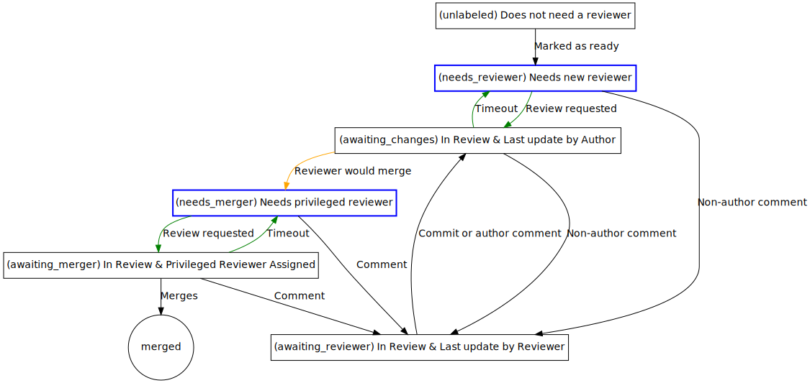

# Quickstart as a contributors

If you opened a pull request and want your pull request reviewed write the following two lines in a comment in the pull request:

```
/marvin opt-in
/status needs_reviewer
```

For more information read the next section.

# General Usage

This bot allows everybody to change a PRs status with a simple comment of the form `/status <new_status_here>`. The right status of a PR depends on which group of people it is currently *actionable* to. The right status is

- `needs_reviewer`, if the PR is ready for review and needs a new reviewer (because it does not yet have one or the reviewer is unresponsive)
- `awaiting_reviewer`, if the PR is in review (i.e. at least one reviewer is involved in the discussion or requested) and is blocked on feedback from the reviewer.
- `awaiting_changes` if the PR in its current form is not ready yet. Issues of this state are usually only actionable to the PR author, although outside help is of course also possible.
- `needs_merger` if the PR has been reviewed and the reviewer *would merge this PR if they could*, but does not have the permission to do so. Think of this as a merge-button by proxy. PRs of this state are actionable for contributors with merge permission. These contributors may have further feedback, but the reviewer should make an honest effort to anticipate the feedback and get all issues resolved *before* setting the status to `needs_merger`.
- `awaiting_merger` if a reviewer with merge permission has been assigned but has not responded yet.

Most of the time, marvin will do the transitions automatically. You can get an overview here:


The most interesting labels are `needs_reviewer` and `needs_merger`. Those make PRs that need attention easily discoverable. In fact, marvin will even try to assign reviewers when enough reviewers are registered. It will regularly perform the following triage:

# Automatic Triage

- Search for `awaiting_reviewer`, `awaiting_merger` sorted by least recently updated. Timeout those that are stale for 3 days.
- Search for `needs_merger` sorted by oldest. Assign reviewers with merge permission as long as available.
- Search for `needs_reviewer` sorted by oldest. Assign reviewers (with or without merge permission) as long as available.

# Tips for Reviewers

As explained previously, any PR with the `needs_reviewer` label should be actionable for any reviewer. There are cases where you may feel that it is not actionable for you. Here are some tips how to proceed:

- If you don't understand parts of the changes: Give a review and ask the PR author for clarifications! The PR author should then usually add the clarifications as comments to the nix expression. This is very valuable feedback. In fact, sometimes it is useful to be a bit naive on purpose. All source code should be well-documented and commented.

- If you think somebody with a very specific expertise should look at the PR: Try to find out who that could be (for example by looking at similar files and who has changed them in the past) and ping them. Delegation is also an action, and often the best one.
